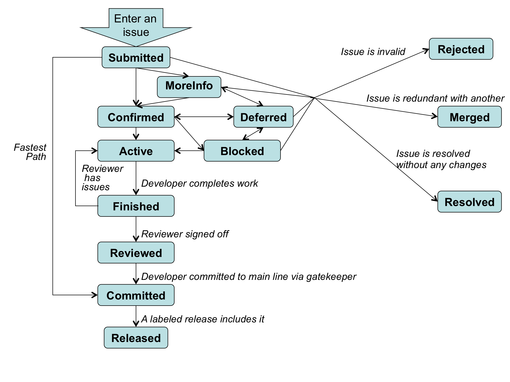
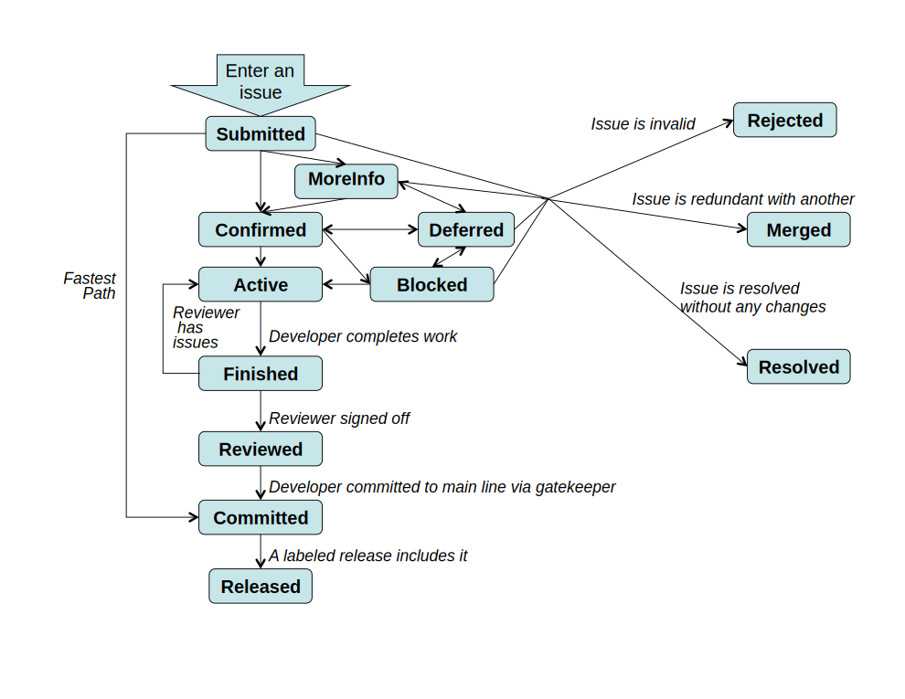

OpenCPI Issues - THIS IS A TEST PAGE AND NOT FINISHED
==============

We use the github issues system for issue tracking for OpenCPI.  We use a specific set of labels to properly manage and track issues.  When submitting an issue, please follow the guidelines below for labeling an issue as you submit it.

